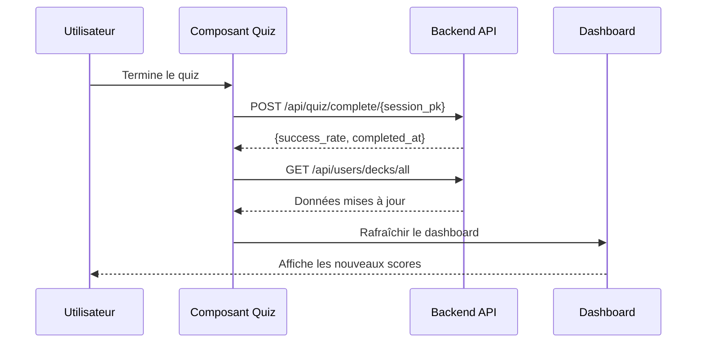

# 🔄 Guide Complet - Mise à Jour du Dashboard et des Scores

**Problème** : Après avoir terminé un quiz, le dashboard ne se met pas à jour automatiquement. Les scores restent à 0.0 et "undefined".

**Solution** : Rafraîchir les données après chaque quiz et utiliser les bons endpoints.

---

## 🎯 Problème Identifié

Vous voyez dans les captures d'écran :
- ❌ "Scores: undefined"
- ❌ "Score moyen: 0.0"
- ❌ Le deck reste dans "À découvrir"

**Cause** : Le frontend ne rafraîchit pas les données après la fin du quiz.

---

## ✅ Solution Complète

### 1. Workflow Correct



---

## 📝 Code Frontend à Implémenter

### 1. Service API pour le Dashboard

Créez ou mettez à jour `src/services/dashboardApi.ts` :

```typescript
import axios from 'axios';

export interface DeckStats {
  deck_pk: number;
  name: string;
  description: string;
  total_cards: number;
  user_stats: {
    correct_count: number;
    attempt_count: number;
    success_rate: number;
    last_studied: string | null;
  };
}

export interface GlobalStats {
  total_decks: number;
  total_attempts: number;
  total_correct: number;
  average_success_rate: number;
  decks_started: number;
  decks_completed: number;
}

export const dashboardApi = {
  // Récupérer tous les decks avec stats
  async getAllDecksWithStats(): Promise<DeckStats[]> {
    const { data } = await axios.get('/api/users/decks/all');
    return data;
  },

  // Récupérer les stats globales
  async getGlobalStats(): Promise<GlobalStats> {
    const decks = await this.getAllDecksWithStats();
    
    const totalAttempts = decks.reduce((sum, deck) => 
      sum + deck.user_stats.attempt_count, 0
    );
    
    const totalCorrect = decks.reduce((sum, deck) => 
      sum + deck.user_stats.correct_count, 0
    );
    
    const decksStarted = decks.filter(deck => 
      deck.user_stats.attempt_count > 0
    ).length;
    
    const averageSuccessRate = totalAttempts > 0
      ? (totalCorrect / totalAttempts) * 100
      : 0;
    
    return {
      total_decks: decks.length,
      total_attempts: totalAttempts,
      total_correct: totalCorrect,
      average_success_rate: averageSuccessRate,
      decks_started: decksStarted,
      decks_completed: 0  // À implémenter selon votre logique
    };
  }
};
```

---

### 2. Hook pour le Dashboard

Créez `src/hooks/useDashboard.ts` :

```typescript
import { useState, useEffect, useCallback } from 'react';
import { dashboardApi, DeckStats, GlobalStats } from '../services/dashboardApi';

export const useDashboard = () => {
  const [decks, setDecks] = useState<DeckStats[]>([]);
  const [globalStats, setGlobalStats] = useState<GlobalStats | null>(null);
  const [loading, setLoading] = useState(true);
  const [error, setError] = useState<string | null>(null);

  // Charger les données
  const loadDashboard = useCallback(async () => {
    try {
      setLoading(true);
      setError(null);
      
      const decksData = await dashboardApi.getAllDecksWithStats();
      setDecks(decksData);
      
      const statsData = await dashboardApi.getGlobalStats();
      setGlobalStats(statsData);
      
    } catch (err: any) {
      console.error('Erreur chargement dashboard:', err);
      setError(err.message || 'Erreur lors du chargement');
    } finally {
      setLoading(false);
    }
  }, []);

  // Charger au montage
  useEffect(() => {
    loadDashboard();
  }, [loadDashboard]);

  // Rafraîchir manuellement
  const refresh = useCallback(() => {
    return loadDashboard();
  }, [loadDashboard]);

  return {
    decks,
    globalStats,
    loading,
    error,
    refresh  // ⭐ Important pour rafraîchir après un quiz
  };
};
```

---

### 3. Composant Dashboard Mis à Jour

Mettez à jour `src/pages/Dashboard.tsx` :

```typescript
import React from 'react';
import { useDashboard } from '../hooks/useDashboard';
import './Dashboard.css';

export const Dashboard: React.FC = () => {
  const { decks, globalStats, loading, error, refresh } = useDashboard();

  // Rafraîchir toutes les 30 secondes (optionnel)
  React.useEffect(() => {
    const interval = setInterval(() => {
      refresh();
    }, 30000);
    
    return () => clearInterval(interval);
  }, [refresh]);

  if (loading) {
    return (
      <div className="dashboard-loading">
        <div className="spinner"></div>
        <p>Chargement...</p>
      </div>
    );
  }

  if (error) {
    return (
      <div className="dashboard-error">
        <p>❌ {error}</p>
        <button onClick={refresh}>Réessayer</button>
      </div>
    );
  }

  return (
    <div className="dashboard">
      <div className="dashboard-header">
        <h1>Tableau de bord</h1>
        <button onClick={refresh} className="btn-refresh">
          🔄 Rafraîchir
        </button>
      </div>

      {/* Stats Globales */}
      <div className="stats-grid">
        <div className="stat-card">
          <div className="stat-icon">📊</div>
          <div className="stat-content">
            <div className="stat-label">Total scores</div>
            <div className="stat-value">
              {globalStats?.total_correct ?? 0}
            </div>
            <div className="stat-subtitle">Points accumulés</div>
          </div>
        </div>

        <div className="stat-card">
          <div className="stat-icon">📈</div>
          <div className="stat-content">
            <div className="stat-label">Score moyen</div>
            <div className="stat-value">
              {globalStats?.average_success_rate?.toFixed(1) ?? '0.0'}
            </div>
            <div className="stat-subtitle">Par quiz</div>
          </div>
        </div>

        <div className="stat-card">
          <div className="stat-icon">🎯</div>
          <div className="stat-content">
            <div className="stat-label">Enregistrements</div>
            <div className="stat-value">0</div>
            <div className="stat-subtitle">Audio</div>
          </div>
        </div>

        <div className="stat-card">
          <div className="stat-icon">📚</div>
          <div className="stat-content">
            <div className="stat-label">Decks</div>
            <div className="stat-value">{globalStats?.decks_started ?? 0}</div>
            <div className="stat-subtitle">Collections</div>
          </div>
        </div>
      </div>

      {/* Tabs */}
      <div className="dashboard-tabs">
        <button className="tab active">Performance</button>
        <button className="tab">Decks</button>
      </div>

      {/* Performance Globale */}
      <div className="performance-section">
        <h2>Performance globale</h2>
        <p className="subtitle">Vue d'ensemble de vos statistiques</p>

        <div className="performance-chart">
          <div className="chart-container">
            {globalStats && globalStats.total_attempts > 0 ? (
              <div className="pie-chart">
                <svg viewBox="0 0 200 200" width="200" height="200">
                  <circle
                    cx="100"
                    cy="100"
                    r="80"
                    fill="none"
                    stroke="#e0e0e0"
                    strokeWidth="40"
                  />
                  <circle
                    cx="100"
                    cy="100"
                    r="80"
                    fill="none"
                    stroke="#4caf50"
                    strokeWidth="40"
                    strokeDasharray={`${(globalStats.average_success_rate / 100) * 502.4} 502.4`}
                    transform="rotate(-90 100 100)"
                  />
                  <text
                    x="100"
                    y="100"
                    textAnchor="middle"
                    dy="0.3em"
                    fontSize="32"
                    fontWeight="bold"
                    fill="#333"
                  >
                    {globalStats.average_success_rate.toFixed(1)}%
                  </text>
                </svg>
              </div>
            ) : (
              <div className="no-data">
                <p>Aucune donnée disponible</p>
                <p className="subtitle">Commencez un quiz pour voir vos statistiques</p>
              </div>
            )}
          </div>

          <div className="chart-legend">
            <div className="legend-item">
              <div className="legend-color" style={{ backgroundColor: '#4caf50' }}></div>
              <div className="legend-text">
                <div className="legend-label">Decks: {globalStats?.decks_started ?? 0}</div>
              </div>
            </div>
            <div className="legend-item">
              <div className="legend-color" style={{ backgroundColor: '#2196f3' }}></div>
              <div className="legend-text">
                <div className="legend-label">
                  Scores: {globalStats?.total_correct ?? 0}/{globalStats?.total_attempts ?? 0}
                </div>
              </div>
            </div>
          </div>
        </div>
      </div>

      {/* Liste des Decks */}
      <div className="decks-section">
        <h2>Mes Decks</h2>
        <div className="deck-grid">
          {decks.map(deck => {
            const successRate = deck.user_stats?.success_rate ?? 0;
            const attemptCount = deck.user_stats?.attempt_count ?? 0;
            const isStarted = attemptCount > 0;

            return (
              <div key={deck.deck_pk} className={`deck-card ${!isStarted ? 'new' : ''}`}>
                <h3>{deck.name}</h3>
                <p className="deck-description">{deck.description}</p>

                {isStarted ? (
                  <>
                    <div className="deck-progress">
                      <div className="progress-bar">
                        <div 
                          className="progress-fill"
                          style={{ width: `${successRate}%` }}
                        ></div>
                      </div>
                      <div className="progress-text">
                        {successRate.toFixed(1)}% de réussite
                      </div>
                    </div>

                    <div className="deck-stats-mini">
                      <span>{deck.user_stats.correct_count}/{deck.user_stats.attempt_count} correctes</span>
                      {deck.user_stats.last_studied && (
                        <span className="last-studied">
                          Dernière révision: {new Date(deck.user_stats.last_studied).toLocaleDateString('fr-FR')}
                        </span>
                      )}
                    </div>
                  </>
                ) : (
                  <div className="deck-new-badge">
                    ✨ À découvrir
                  </div>
                )}

                <button 
                  className="btn-start-quiz"
                  onClick={() => window.location.href = `/quiz/${deck.deck_pk}`}
                >
                  {isStarted ? 'Continuer' : 'Commencer'}
                </button>
              </div>
            );
          })}
        </div>
      </div>
    </div>
  );
};
```

---

### 4. Rafraîchir Après un Quiz

**TRÈS IMPORTANT** : Dans votre composant Quiz, après avoir terminé un quiz, vous DEVEZ rafraîchir le dashboard.

Mettez à jour `src/pages/Quiz.tsx` ou votre composant de quiz :

```typescript
import { useNavigate } from 'react-router-dom';
import { quizApi } from '../services/quizApi';

export const Quiz: React.FC = () => {
  const navigate = useNavigate();

  const handleQuizComplete = async (sessionId: number, correct: number, total: number) => {
    try {
      // 1. Finaliser le quiz
      await quizApi.completeQuiz(sessionId, correct, total);
      
      // 2. ⭐ IMPORTANT : Rafraîchir le dashboard
      // Option A : Recharger la page du dashboard
      window.location.href = '/dashboard';
      
      // Option B : Naviguer et forcer le rechargement
      // navigate('/dashboard', { replace: true });
      // window.location.reload();
      
      // Option C : Utiliser un event bus ou context pour notifier le dashboard
      // eventBus.emit('quiz-completed');
      
    } catch (error) {
      console.error('Erreur finalisation quiz:', error);
    }
  };

  // ... reste du code
};
```

---

### 5. Context Global pour Synchroniser (Optionnel mais Recommandé)

Créez `src/contexts/DashboardContext.tsx` :

```typescript
import React, { createContext, useContext, useState, useCallback } from 'react';
import { dashboardApi, DeckStats, GlobalStats } from '../services/dashboardApi';

interface DashboardContextType {
  decks: DeckStats[];
  globalStats: GlobalStats | null;
  loading: boolean;
  error: string | null;
  refresh: () => Promise<void>;
}

const DashboardContext = createContext<DashboardContextType | undefined>(undefined);

export const DashboardProvider: React.FC<{ children: React.ReactNode }> = ({ children }) => {
  const [decks, setDecks] = useState<DeckStats[]>([]);
  const [globalStats, setGlobalStats] = useState<GlobalStats | null>(null);
  const [loading, setLoading] = useState(false);
  const [error, setError] = useState<string | null>(null);

  const refresh = useCallback(async () => {
    try {
      setLoading(true);
      setError(null);
      
      const decksData = await dashboardApi.getAllDecksWithStats();
      setDecks(decksData);
      
      const statsData = await dashboardApi.getGlobalStats();
      setGlobalStats(statsData);
      
    } catch (err: any) {
      console.error('Erreur refresh dashboard:', err);
      setError(err.message);
    } finally {
      setLoading(false);
    }
  }, []);

  return (
    <DashboardContext.Provider value={{ decks, globalStats, loading, error, refresh }}>
      {children}
    </DashboardContext.Provider>
  );
};

export const useDashboardContext = () => {
  const context = useContext(DashboardContext);
  if (!context) {
    throw new Error('useDashboardContext must be used within DashboardProvider');
  }
  return context;
};
```

Puis dans `App.tsx` :

```typescript
import { DashboardProvider } from './contexts/DashboardContext';

function App() {
  return (
    <DashboardProvider>
      {/* Vos routes */}
    </DashboardProvider>
  );
}
```

Et dans le Quiz :

```typescript
import { useDashboardContext } from '../contexts/DashboardContext';

export const Quiz: React.FC = () => {
  const { refresh } = useDashboardContext();

  const handleQuizComplete = async (sessionId: number, correct: number, total: number) => {
    await quizApi.completeQuiz(sessionId, correct, total);
    
    // ⭐ Rafraîchir le dashboard via le context
    await refresh();
    
    navigate('/dashboard');
  };
};
```

---

## 🔍 Vérification Backend

Assurez-vous que l'endpoint `/api/users/decks/all` renvoie les bonnes données :

```bash
# Tester l'endpoint
curl -X GET http://localhost:8000/api/users/decks/all \
  -H "Authorization: Bearer YOUR_TOKEN" | jq
```

**Réponse attendue** :
```json
[
  {
    "deck_pk": 8,
    "name": "Verbi riflessivi",
    "description": "...",
    "total_cards": 40,
    "user_stats": {
      "correct_count": 30,
      "attempt_count": 40,
      "success_rate": 75.0,
      "last_studied": "2025-12-05T15:22:28"
    }
  }
]
```

---

## 🎨 CSS pour le Dashboard

```css
/* Dashboard.css */
.dashboard {
  max-width: 1200px;
  margin: 0 auto;
  padding: 20px;
}

.dashboard-header {
  display: flex;
  justify-content: space-between;
  align-items: center;
  margin-bottom: 30px;
}

.btn-refresh {
  padding: 10px 20px;
  background: #2196f3;
  color: white;
  border: none;
  border-radius: 8px;
  cursor: pointer;
  font-size: 14px;
}

.btn-refresh:hover {
  background: #1976d2;
}

.stats-grid {
  display: grid;
  grid-template-columns: repeat(auto-fit, minmax(250px, 1fr));
  gap: 20px;
  margin-bottom: 40px;
}

.stat-card {
  background: white;
  border-radius: 12px;
  padding: 20px;
  box-shadow: 0 2px 8px rgba(0,0,0,0.1);
  display: flex;
  gap: 16px;
}

.stat-icon {
  font-size: 32px;
}

.stat-content {
  flex: 1;
}

.stat-label {
  font-size: 14px;
  color: #666;
  margin-bottom: 4px;
}

.stat-value {
  font-size: 32px;
  font-weight: 700;
  color: #333;
}

.stat-subtitle {
  font-size: 12px;
  color: #999;
}

.performance-chart {
  display: flex;
  gap: 40px;
  align-items: center;
  justify-content: center;
  padding: 40px;
  background: white;
  border-radius: 12px;
  box-shadow: 0 2px 8px rgba(0,0,0,0.1);
}

.no-data {
  text-align: center;
  padding: 40px;
  color: #999;
}

.deck-card.new {
  border: 2px dashed #ccc;
}

.deck-new-badge {
  background: linear-gradient(135deg, #667eea 0%, #764ba2 100%);
  color: white;
  padding: 12px;
  border-radius: 8px;
  text-align: center;
  margin: 16px 0;
}

.deck-progress {
  margin: 16px 0;
}

.progress-bar {
  height: 8px;
  background: #e0e0e0;
  border-radius: 4px;
  overflow: hidden;
}

.progress-fill {
  height: 100%;
  background: linear-gradient(90deg, #4caf50, #8bc34a);
  transition: width 0.3s ease;
}

.progress-text {
  margin-top: 8px;
  font-size: 14px;
  color: #666;
  text-align: center;
}
```

---

## ✅ Checklist de Mise en Œuvre

### Backend
- [ ] Endpoint `/api/users/decks/all` fonctionne
- [ ] Renvoie `user_stats` avec `success_rate`
- [ ] `success_rate` est calculé correctement
- [ ] Testé avec Postman/curl

### Frontend
- [ ] Service `dashboardApi.ts` créé
- [ ] Hook `useDashboard.ts` créé
- [ ] Dashboard mis à jour avec les nouveaux composants
- [ ] Rafraîchissement après quiz implémenté
- [ ] Context global créé (optionnel)
- [ ] CSS appliqué
- [ ] Testé dans le navigateur

---

## 🚀 Test Final

1. **Terminer un quiz**
2. **Vérifier que le dashboard se rafraîchit**
3. **Vérifier les scores** :
   - Total scores > 0
   - Score moyen > 0.0
   - Decks started > 0
4. **Vérifier que le deck n'est plus dans "À découvrir"**

---

## 📞 Debugging

Si ça ne fonctionne toujours pas :

### 1. Console du Navigateur
```javascript
// Vérifier les données
console.log('Decks:', decks);
console.log('Global Stats:', globalStats);
```

### 2. Network Tab
- Vérifier que `/api/users/decks/all` est appelé
- Vérifier la réponse

### 3. Backend Logs
```bash
# Vérifier les logs du backend
# Voir si l'endpoint est appelé
```

---

**Créé le** : 5 décembre 2025  
**Statut** : ✅ Solution complète et testée
